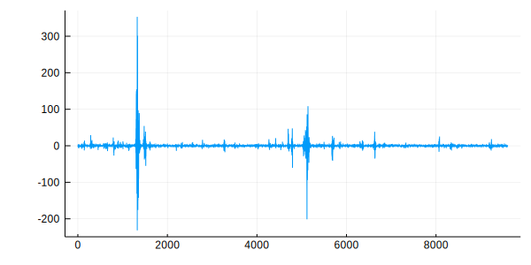

# AlphaStableDistributions

[](https://travis-ci.org/baggepinnen/AlphaStableDistributions.jl)
[](https://codecov.io/gh/baggepinnen/AlphaStableDistributions.jl)

This library is a port of functionality from [arlpy](https://github.com/org-arl/arlpy/blob/master/arlpy/stable.py). The two distributions supported are
- [alpha-stable distribution](https://en.wikipedia.org/wiki/Stable_distribution) (`rand` and `fit`)
- [alpha sub-Gaussian distribution with memory](https://arl.nus.edu.sg/twiki6/pub/ARL/BibEntries/SigProc2016RandomVariate.pdf) (`rand`)

## Installation
```julia
using Pkg; pkg"add https://github.com/baggepinnen/AlphaStableDistributions.jl"
```

## Usage
```julia
julia> using AlphaStableDistributions

julia> d1 = AlphaStable()
AlphaStable{Float64}(α=1.5, β=0.0, scale=1.0, location=0.0)

julia> s = rand(d1, 100000);

julia> d2 = fit(AlphaStable, s)

AlphaStable{Float64}(α=1.4748701622930906, β=0.0, scale=1.006340087707924, location=-0.0036724481641865715)

julia> x = rand(AlphaSubGaussian(n=9600));

julia> plot(x)
```


### Credits
Julia code by [@ymtoo](https://github.com/ymtoo) and [@baggepinnen](https://github.com/baggepinnen), original implementation by [@mchitre](https://github.com/mchitre) and others.
